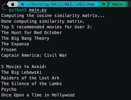

This is a recommendation engine for movies, which allows to display 5 recommended and 5 to avoid based on specified user
Authors: Aleksander Misztal s22019, Michał Kalinowski s22464

To run the program, you should start the Integrated Development Environment (IDE), make sure to have all the listed imports and run the main file: 
    pandas
    numpy
    scikit-fuzzy
    matplotlib
    scikit-learn
    ipykernel
    openpyxl
    scikit-surprise

