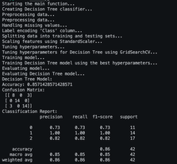
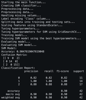
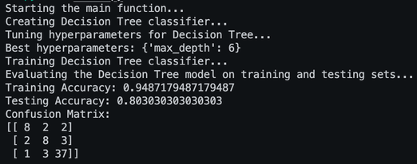
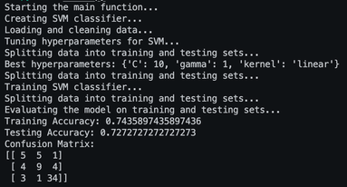

This is a project which uses SVM and Decision Tree in order to classify sets of data by learning on them and showing the quality of the classification.

Authors: Aleksander Misztal s22019, Michał Kalinowski s22464

To run the program, you should start the Integrated Development Environment (IDE), make sure to have all the listed imports and run one of the two files:

pandas
numpy
scikit-fuzzy
matplotlib
scikit-learn
ipykernel
openpyxl
scikit-surprise
tensorflow
scikit-image

Task 1 WheatSeeds Decision Tree:

Task 1 WheatSeeds SVM:

Task 2 CarsClassifier DecisionTree:

Task 2 CarsClassifier SVM:

