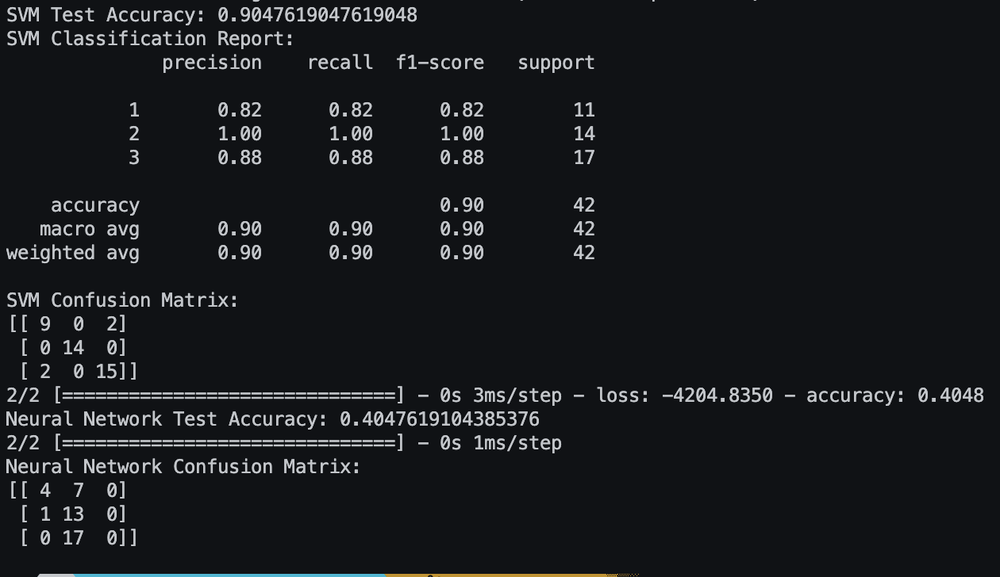
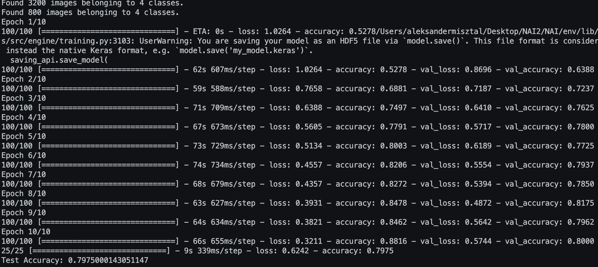
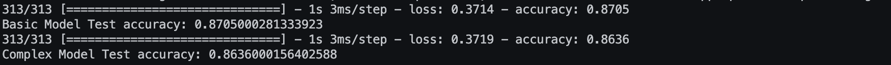
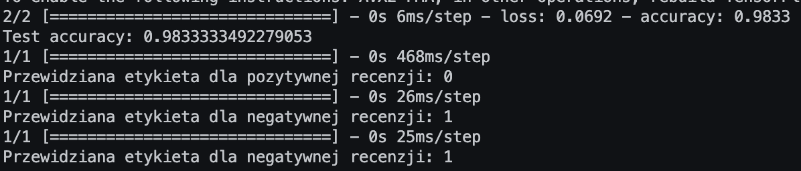

Authors: Aleksander Misztal s22019, Michał Kalinowski s22464

Task 1 + Confusion Matrix

This script demonstrates the use of Support Vector Machine (SVM) and Neural Network models
for classification on a wheat dataset.

The dataset is loaded from a CSV file, and the features and labels are extracted.
The script then splits the data into training and testing sets for both SVM and Neural Network models.
It trains an SVM classifier with a linear kernel, makes predictions, and evaluates the model.
Next, a Neural Network model is built, trained, and evaluated on the same dataset.

Note: The dataset file 'wheat.csv' should be available in the 'data' directory.

Task 2

This script demonstrates the implementation of a Convolutional Neural Network (CNN)
for image classification on an Animals dataset.

The dataset is loaded using the TensorFlow ImageDataGenerator, and a CNN model is created.
The model is compiled, and training is performed using data augmentation and normalization.
Callbacks such as EarlyStopping and ModelCheckpoint are used during training.

Note: The dataset should be organized in subdirectories under 'data/Animals' with one subdirectory per class.

Task 3 + comparison of basic architecture to 2 hidden layers

This script demonstrates the implementation of basic and complex neural network models
for image classification on the Fashion MNIST dataset.

The Fashion MNIST dataset is loaded, normalized, and transformed into categorical labels.
Two neural network models are created: a basic model and a more complex model with two hidden layers.
Both models are compiled, trained, and evaluated on the test set.

Note: The script assumes that the necessary libraries are installed and the Fashion MNIST dataset
is available through Keras.

Task 4

Sentiment Analysis Model
This script demonstrates sentiment analysis using a Long Short-Term Memory (LSTM) neural network.
The model is trained on a dataset of reviews and predicts whether a given review is positive or negative.

