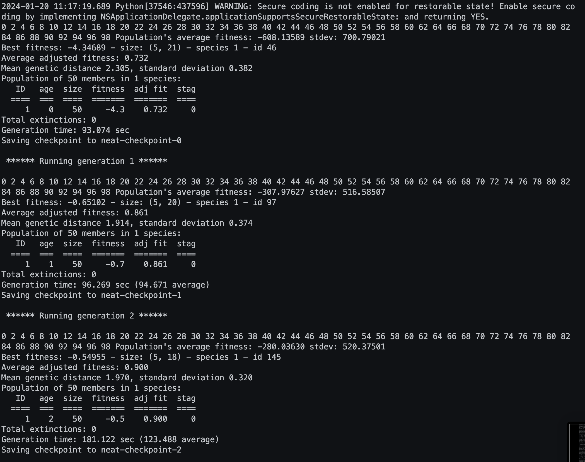

Authors: Aleksander Misztal s22019, Michał Kalinowski s22464

Pong Game with NEAT AI

This program implements a Pong game where the AI is trained using the NEAT (NeuroEvolution of Augmenting Topologies) algorithm. The AI evolves by playing against itself, and the best-performing neural network is saved for later testing against a human player.

Dependencies:
- pygame: Pygame library for creating the game window and handling input
- neat: NEAT algorithm library for evolving neural networks
- pong: Assuming a module named 'pong' is present, containing the Game class

Usage:
1. Run the script to train the AI using the NEAT algorithm.
2. The best-performing neural network is saved in 'best.pickle'.
3. Test the trained AI against a human player by running the script again.

